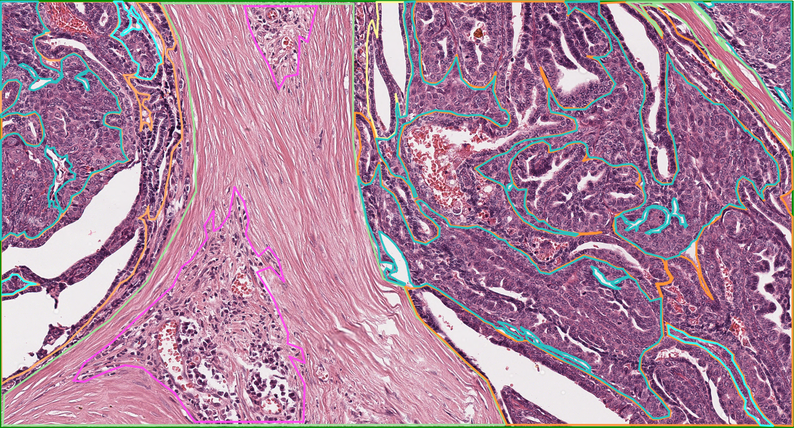
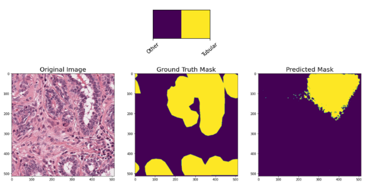

# CanineMammaryTumors

This repository contains code examples for working with a dataset of microscopic whole slide images.
It is an adaptation of the CanineCutaneousTumors repository that can be found [here](https://github.com/DeepPathology/CanineCutaneousTumors).

This repository contains code examples for working with our publicly available dataset on microscopicwhole slide images 
(WSIs) of canine cutaneous tumors. The dataset can be downloaded via the website of The Cancer Imaging Atlas: .

  

## Segmentation
For the segmentation network training of different classes a Jupyter notebook is provided.

* Training: [segmentation_training.ipynb](segmentation/segmentation_training.ipynb)
* Inference on Patch Level: [patch_segmentation_inference.ipynb](segmentation/patch_segmentation_inference.ipynb)
* Inference on Slide Level: [slide_segmentation_inference.ipynb](segmentation/slide_segmentation_inference.ipynb)

## Visualization Patch Prediction Tubule Formation

  

## Visualization Patch Prediction Nuclear Pleomorphism

  

## Pre-trained models
We provide two pre-trained models for patch segmentation and classification. These can be found in the 
[models](models) folder. 
<!-- A detailed evaluation of these models can be found in our ScientificData paper:   
> Link to paper -->

  