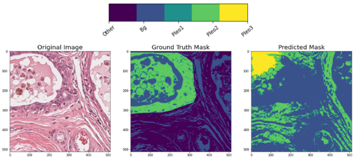

# CanineMammaryTumors

This repository contains code for building a segmentation model for microscopic whole slide images. Initially this code was used for the segmentation of biomarkers in Canine Mammary Tumors as a part of the bachelor thesis by Laura Klose. 
The project is an adaptation of the CanineCutaneousTumors repository that can be found [here](https://github.com/DeepPathology/CanineCutaneousTumors).

  

## Segmentation
For the segmentation network training of different classes a Jupyter notebook is provided.

* Training: [segmentation_training_pipeline.ipynb](segmentation/segmentation_training_pipeline.ipynb)
* Inference on Patch Level: [patch_segmentation_inference.ipynb](segmentation/patch_segmentation_inference.ipynb)
* Inference on Slide Level: [slide_segmentation_inference.ipynb](segmentation/slide_segmentation_inference.ipynb)

## Visualization Patch Prediction Tubule Formation

  

## Visualization Patch Prediction Nuclear Pleomorphism

  

## Limitations 

Due to the limitation of having only a small dataset of such complex images, the segmentation accuracy of the final network was low. 
However, this pipeline can be used as a baseline for future works.

<!-- ## Pre-trained models
We provide two pre-trained models for patch segmentation and classification. These can be found in the 
[models](models) folder. 
<!-- A detailed evaluation of these models can be found in our ScientificData paper:   
<!-- > Link to paper --> 

  